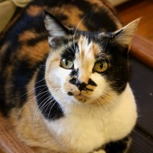
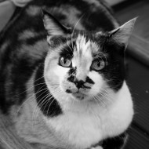

# ppmm

Image manipulation using the Portable PixMap format.

## Quick start

To quickly build the project you can simply run make

```bash
$ make
```

## Example

```bash
$ ./filter > cat_bw.ppm
$ ./filter > cat_inv.ppm
```




