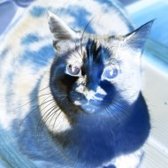

# ppmm

Image manipulation using the Portable PixMap format.

## Quick start

To quickly build the project you can simply run make

```bash
$ make
```

## Example

```bash
$ ./ppmm g cat.ppm cat_bw.ppm
$ ./ppmm i cat.ppm cat_inv.ppm
$ ./ppmm m cat.ppm cat_mul.ppm
$ ./ppmm c cat.ppm cat_col.ppm
```




